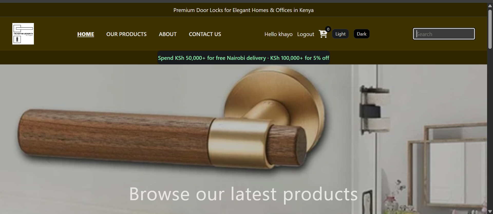
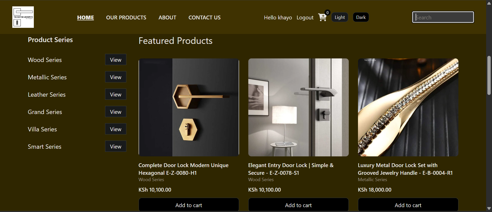

# The Kenyan Locksmith

Website for premium door locks and handles for homes and offices in Kenya.

Customers can browse series, filter and search locks, add them to a bag, and send an enquiry. Checkout is simulated. Login is required only when paying.
## Problem

Specialist lock shops in Kenya are hard to find online. Many buyers only see general hardware stores, Facebook posts, or a physical shop. They cannot compare series, prices, or stock in one place.

## Solution

This site is a small online catalogue plus a cart.

- Products load from a local Express API
- Filters: series, name or SKU, price, in stock
- Cart and login use `localStorage`
- Spend KSh 50,000+ for free Nairobi delivery (simulated)
- Spend KSh 100,000+ for 5% off (simulated)
- Contact form saves an enquiry
- Cookie banner, light/dark theme, shop hours on Contact / About

This is a class project. There is no real payment or email server.

## Features

### Home
- Hero and series shortcuts (`?series=Wood`)
- Featured products from the API
- Header search, cart badge, theme buttons

### All Products
- Full list from `GET /api/products`
- Search, series, sort, in-stock filter
- Click a card for `product.html?id=`

### Product
- One lock: image, series, SKU, price, stock
- Add to cart

### Cart and checkout
- Add, + / -, remove (confirm), subtotal
- Bag saved in `localStorage`
- Checkout: pickup or deliver
- Login wall: `login.html?next=checkout`
- After order: cart cleared, then All Products

### Contact
- Name, email, phone, subject, comment
- Validation, Sending…, enquiry in `localStorage`
- Open / Closed (Mon-Sat 07:00-18:00 EAT)

### Account
- Register (name, email, password, confirm)
- Login checks the saved email and password
- Header Login/Logout and welcome name

## File structure
```
backend/
 server.js         Express API on port 3001
 package.json

index.html
ourproducts.html
product.html
about.html
contact.html
login.html
checkout.html
main.js
style.css
images/
  ```
## Installation setup
To run this project

Need Node.js
```
git clone https://github.com/JohnnyKhayo/locksmith.git
cd locksmith/backend
npm install
node server.js
```
API: http://localhost:3001/api/products

In another terminal, open the frontend with Live Server (port 5502 or similar).

Keep both running. If the API is off, the grids show “Start the API”.

## How the project looks
## How the project looks



## How to demoHome - featured cards  
1. All Products → filter Wood, search a SKU  
2. Add to cart → badge and drawer  
3. Checkout while logged out → register/login  
4. Place order → bag empties

5. Application tab: cart, users, currentUser, theme, enquiry. Cookie: cookiesAccepted.

## Collaborate and contribution
1. Fork and clone
```
https://github.com/JohnnyKhayo/locksmith.git
```
2. Branch, commit, pull request
3. Open an issue if you change behaviour

## License
This project was created abd build by under MIT license.
 @ JohnnyKhayo

Repo **short description** (GitHub About):
```
Vanilla JS lock shop: Express API, cart in localStorage, filters, checkout and login.
```